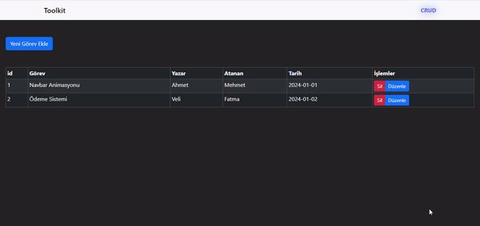

<h1> Redux-Toolkit / To do list </h1>

Redux Toolkit ile yapılacakları hazırladığımız,düzenlediğimiz veya silebildiğimiz to do list

<h2> Kullanılan Teknolojiler </h2>

Toolkit,React-redux,React-router-dom ve React Bootstrap kullanılarak geliştirilmiştir.

<h2> Çalışır Halinin Ekran Kaydı </h2>

